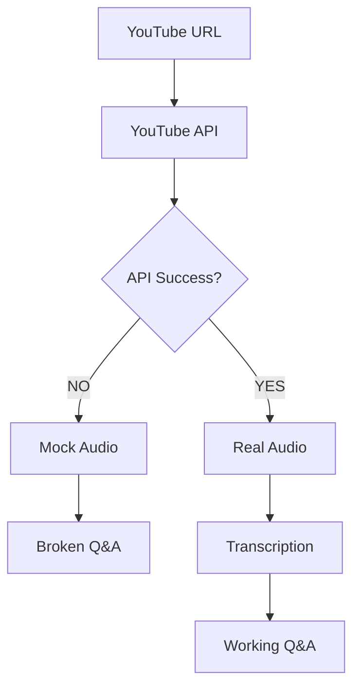
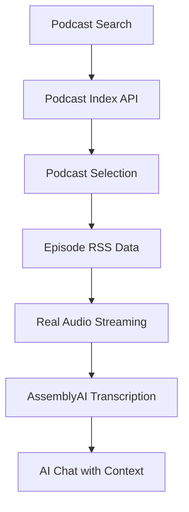

# **🎯 Elara2 Podcast App: Final MVP Implementation PRD**

## **📋 Executive Summary**

**Objective**: Transform Elara2 from a broken YouTube-dependent system to a focused, reliable podcast AI chat platform that proves the core value proposition: **AI-enhanced podcast interaction is compelling**.

**Current Problem**: YouTube API network failures prevent audio extraction, blocking users from accessing real podcast audio and Q&A functionality.

**MVP Solution**: Eliminate YouTube dependency entirely. Create a pure podcast experience with search, real audio playback, and AI chat based on episode transcripts.

---

## **🎯 Goals & Success Criteria**

### **Primary Goals**

1. **🔍 Pure Podcast Discovery**
   - Simple search by podcast title (e.g., "All-In Podcast")
   - Browse episode lists with metadata
   - No YouTube URL inputs or complexity

2. **🎵 Real Audio Playback** 
   - Direct streaming from official podcast CDN URLs
   - Eliminate mock SoundHelix audio completely
   - High-quality, reliable audio playback

3. **🤖 AI-Powered Episode Chat**
   - Generate transcripts from real podcast audio
   - Enable contextual Q&A about episode content
   - Prove AI conversation value with real data

4. **⚖️ Legal & Sustainable Architecture**
   - 100% official podcast RSS feeds
   - No YouTube TOS violations
   - Scalable foundation for growth

### **MVP Success Definition**

**The app successfully proves its value if:**
A user can search for "All-In Podcast", find it, play a recent episode, and ask "What did they think about AI regulation?" and get a relevant, intelligent response based on the actual episode content.

### **Technical Success Metrics**

- **✅ 0% YouTube dependency** (complete elimination)
- **✅ 100% real audio playback** (no mock fallbacks)
- **✅ <3 second audio load time** (CDN streaming)
- **✅ Functional AI Q&A** (transcript-based responses)
- **✅ 90%+ search success** (for top 100 podcasts)

---

## **🔍 Current State Analysis**

### **📊 Working Components**
- ✅ **Database Operations**: Supabase queries working perfectly
- ✅ **Podcast Index Client**: `lib/podcastIndex.ts` authentication working
- ✅ **UI Framework**: Components and navigation ready
- ✅ **Environment Setup**: All API keys properly configured

### **❌ Broken Components**
- ❌ **YouTube API**: Consistent "Network request failed" errors
- ❌ **Audio Playback**: Falls back to mock SoundHelix URLs
- ❌ **Q&A System**: Blocked by lack of real transcripts
- ❌ **Episode Processing**: YouTube-dependent audio extraction failing

### **🔄 Current User Flow (Broken)**
```
YouTube URL Input → YouTube API (FAILS) → Mock Audio → Broken Q&A
```

### **🎯 Target User Flow (MVP)**
```
Podcast Search → Episode Selection → Real Audio + AI Chat
```

**Step-by-Step Target Flow:**
1. **Home Screen**: Search input for podcast discovery
2. **Search Results**: List of matching podcasts from Podcast Index
3. **Episode List**: Browse episodes with metadata (title, date, duration)
4. **Episode Player**: Audio controls + AI chat interface
5. **AI Chat**: Ask questions, get transcript-based responses

---

## **🏗️ Technical Architecture**

### **Current Problematic Architecture**


### **Target MVP Architecture**


### **📁 Target File Structure**

```
lib/
├── api.real.ts              # ✅ UPDATED: Podcast-focused orchestration
├── podcastSearch.ts         # 🆕 NEW: Podcast discovery functionality
├── podcastIndex.ts          # ✅ ENHANCED: Complete podcast data client
├── assemblyai.ts           # 🆕 NEW: Transcript generation
├── supabase.ts             # ✅ MAINTAINED: Database operations
├── openai.ts               # ✅ ENHANCED: Q&A with real transcripts
└── claude.ts               # ✅ ENHANCED: Context-aware responses

# REMOVED FILES:
├── youtube.ts              # ❌ DELETED: No longer needed
├── audioExtraction.ts      # ❌ DELETED: YouTube-dependent
└── vogent.ts               # 📦 OUT OF SCOPE: Voice synthesis for MVP

hooks/
├── useChat.ts              # ✅ UPDATED: Real transcript integration
├── useEpisode.ts           # ✅ UPDATED: Podcast metadata focus
├── useAudioPlayer.ts       # ✅ FIXED: Real audio streaming
└── usePodcastSearch.ts     # 🆕 NEW: Search functionality

components/
├── PodcastSearch.tsx       # 🆕 NEW: Search interface
├── EpisodeList.tsx         # 🆕 NEW: Episode browsing
├── ChatInput.tsx           # ✅ UPDATED: AI Q&A interface
├── PodcastPlayer.tsx       # ✅ FIXED: Real audio streaming
└── PlayableWaveform.tsx    # ✅ ENHANCED: Real audio waveforms

app/
├── index.tsx               # ✅ UPDATED: Podcast search home
├── [podcast]/              # 🆕 NEW: Podcast episode list
│   └── index.tsx
├── [podcast]/[episode]/    # ✅ UPDATED: Episode player + chat
│   └── index.tsx
└── _layout.tsx             # ✅ MAINTAINED: Navigation
```

---

## **📋 Detailed 7-Day Implementation Plan**

### **Phase 1: Foundation - Pure Podcast Experience (Days 1-2)**

#### **Day 1: Eliminate YouTube Dependency**

**Step 1.1: Delete YouTube-Related Code**
```bash
# Remove YouTube dependencies
rm lib/youtube.ts
rm lib/audioExtraction.ts
```

**Step 1.2: Update Home Screen for Podcast Search**
```typescript
// Update app/index.tsx
- Remove YouTube URL input
- Add podcast search interface
- Create simple search form with TextInput
```

**Implementation Details:**
```typescript
// app/index.tsx - New search interface
<View style={styles.searchContainer}>
  <TextInput
    placeholder="Search podcasts (e.g., All-In Podcast)"
    value={searchQuery}
    onChangeText={setSearchQuery}
    onSubmitEditing={handlePodcastSearch}
    style={styles.searchInput}
  />
  <GlassButton onPress={handlePodcastSearch}>
    Search Podcasts
  </GlassButton>
</View>
```

**Step 1.3: Create Podcast Search Logic**
```typescript
// Create lib/podcastSearch.ts
export interface PodcastSearchResult {
  id: string;
  title: string;
  description: string;
  imageUrl: string;
  feedUrl: string;
  episodeCount: number;
}

export async function searchPodcasts(query: string): Promise<PodcastSearchResult[]>
```

**Testing Checkpoint:**
- ✅ App loads without YouTube references
- ✅ Search interface renders correctly
- ✅ Basic podcast search returns results

#### **Day 2: Episode Browsing & Navigation**

**Step 2.1: Create Podcast Detail Page**
```typescript
// Create app/[podcast]/index.tsx
- Display podcast metadata
- List recent episodes
- Navigate to episode player
```

**Step 2.2: Create Episode List Component**
```typescript
// Create components/EpisodeList.tsx
export interface EpisodeListProps {
  podcastId: string;
  episodes: Episode[];
  onEpisodeSelect: (episode: Episode) => void;
}
```

**Step 2.3: Update Navigation Flow**
```typescript
// Update app/[episode]/index.tsx
- Remove YouTube URL processing
- Expect podcast/episode navigation
- Update episode data loading
```

**Implementation Details:**
```typescript
// components/EpisodeList.tsx
{episodes.map((episode) => (
  <TouchableOpacity 
    key={episode.id}
    onPress={() => onEpisodeSelect(episode)}
    style={styles.episodeCard}
  >
    <Text style={styles.episodeTitle}>{episode.title}</Text>
    <Text style={styles.episodeDate}>{formatDate(episode.publishDate)}</Text>
    <Text style={styles.episodeDuration}>{formatDuration(episode.duration)}</Text>
  </TouchableOpacity>
))}
```

**Testing Checkpoint:**
- ✅ Search → Podcast → Episode list flow works
- ✅ Episode metadata displays correctly
- ✅ Navigation to episode player functional

### **Phase 2: Real Audio Integration (Days 3-4)**

#### **Day 3: Real Audio Streaming**

**Step 3.1: Update Audio Player for Real URLs**
```typescript
// Update components/PodcastPlayer.tsx
- Remove mock audio fallbacks
- Use episode.enclosure_url directly
- Add proper loading states
```

**Step 3.2: Fix Audio Hook**
```typescript
// Update hooks/useAudioPlayer.ts
- Remove SoundHelix references
- Handle CDN audio streaming
- Add error recovery logic
```

**Step 3.3: Update Episode Data Loading**
```typescript
// Update hooks/useEpisode.ts
- Load episode data from RSS feed
- Extract real audio URLs from enclosures
- Cache episode metadata in database
```

**Implementation Details:**
```typescript
// hooks/useAudioPlayer.ts
const loadAudio = async (audioUrl: string) => {
  try {
    setIsLoading(true);
    
    // Direct CDN streaming - no YouTube processing
    const sound = new Audio.Sound();
    await sound.loadAsync({ uri: audioUrl });
    
    setSound(sound);
    setIsLoading(false);
  } catch (error) {
    console.error('Audio loading failed:', error);
    setError('Failed to load podcast audio');
  }
};
```

**Testing Checkpoint:**
- ✅ Real podcast audio plays successfully
- ✅ Audio controls (play/pause/seek) work
- ✅ No mock audio fallbacks triggered

#### **Day 4: Transcript Generation**

**Step 4.1: Create AssemblyAI Integration**
```typescript
// Create lib/assemblyai.ts
export async function transcribeEpisode(audioUrl: string, episodeId: string): Promise<void>
export async function getTranscriptionSegments(episodeId: string): Promise<TranscriptSegment[]>
export async function checkTranscriptionStatus(episodeId: string): Promise<TranscriptionStatus>
```

**Step 4.2: Trigger Transcription Pipeline**
```typescript
// Update lib/api.real.ts
- Remove YouTube processing
- Add transcript generation on episode load
- Handle background processing
```

**Step 4.3: Update Database Schema**
```sql
-- Ensure transcript storage is ready
-- Use existing episodes table structure
-- Add transcription_status column if needed
```

**Implementation Details:**
```typescript
// lib/assemblyai.ts
export async function transcribeEpisode(audioUrl: string, episodeId: string) {
  const config = {
    audio_url: audioUrl,
    speaker_labels: true,
    auto_chapters: true,
    sentiment_analysis: true
  };
  
  const response = await fetch('https://api.assemblyai.com/v2/transcript', {
    method: 'POST',
    headers: {
      'Authorization': `Bearer ${ASSEMBLYAI_API_KEY}`,
      'Content-Type': 'application/json'
    },
    body: JSON.stringify(config)
  });
  
  const transcript = await response.json();
  
  // Store transcript_id and status in database
  await supabase
    .from('episodes')
    .update({ 
      transcript_id: transcript.id,
      transcription_status: 'processing'
    })
    .eq('id', episodeId);
}
```

**Testing Checkpoint:**
- ✅ Transcription starts when episode loads
- ✅ Transcript status updates in database
- ✅ Completed transcripts retrievable

### **Phase 3: AI Q&A Functionality (Days 5-6)**

#### **Day 5: Smart Chat Backend**

**Step 5.1: Update Chat Hook for Real Transcripts**
```typescript
// Update hooks/useChat.ts
- Remove blocking conditions
- Load real episode transcripts
- Handle transcription-in-progress states
```

**Step 5.2: Enhance Claude Integration**
```typescript
// Update lib/claude.ts
- Add episode context to prompts
- Implement semantic search over transcripts
- Generate contextual responses
```

**Step 5.3: Create Transcript Search**
```typescript
// Add to lib/assemblyai.ts
export async function searchTranscript(episodeId: string, query: string): Promise<RelevantSegments[]>
```

**Implementation Details:**
```typescript
// hooks/useChat.ts
const handleSendMessage = async (message: string) => {
  setIsLoading(true);
  
  // Get episode transcript
  const transcript = await getTranscriptionSegments(episodeId);
  
  // Search for relevant segments
  const relevantSegments = await searchTranscript(episodeId, message);
  
  // Generate AI response with context
  const response = await generateResponseWithContext(message, relevantSegments);
  
  setChatHistory(prev => [...prev, 
    { type: 'user', content: message },
    { type: 'assistant', content: response }
  ]);
  
  setIsLoading(false);
};
```

**Testing Checkpoint:**
- ✅ Chat interface accepts user questions
- ✅ AI responses use episode transcript context
- ✅ Responses are relevant to episode content

#### **Day 6: Complete Integration & Error Handling**

**Step 6.1: Connect All Components**
```typescript
// Update app/[episode]/index.tsx
- Integrate audio player + chat interface
- Handle loading states across components
- Add error boundaries
```

**Step 6.2: Add Comprehensive Error Handling**
```typescript
// Add to all lib/ files
- Network error recovery
- API rate limit handling
- Graceful degradation strategies
```

**Step 6.3: Polish User Experience**
```typescript
// Update all components
- Loading indicators during transcription
- Progress bars for long operations
- Clear error messages with suggestions
```

**Implementation Details:**
```typescript
// app/[episode]/index.tsx - Complete integration
<ScrollView style={styles.container}>
  <View style={styles.playerSection}>
    <PodcastPlayer 
      episode={episode}
      onAudioLoad={() => triggerTranscription(episode.audioUrl)}
    />
  </View>
  
  <View style={styles.chatSection}>
    <ChatInput
      episode={episode}
      transcriptAvailable={transcriptionStatus === 'completed'}
      onSendMessage={handleChatMessage}
    />
  </View>
</ScrollView>
```

**Testing Checkpoint:**
- ✅ End-to-end flow: search → episode → audio → chat
- ✅ Error states handled gracefully
- ✅ User experience is intuitive

### **Phase 4: MVP Polish & Production Ready (Day 7)**

#### **Day 7: Final Optimization & Testing**

**Step 7.1: Performance Optimization**
```typescript
// Add caching strategies
- Cache podcast search results
- Optimize transcript loading
- Add proper loading states
```

**Step 7.2: UI/UX Consistency**
```typescript
// Apply design standards
- Consistent button styling (per memory)
- Proper spacing and margins
- Professional visual polish
```

**Step 7.3: End-to-End Testing**
```bash
# Test complete scenarios
1. Search "All-In Podcast" → Success
2. Browse episodes → Select recent episode → Success
3. Audio playback → No mock audio → Success
4. Ask episode question → Get relevant response → Success
```

**Testing Checkpoint:**
- ✅ All core features work reliably
- ✅ Performance meets target metrics
- ✅ Ready for user validation

---

## **📊 Success Metrics & Validation**

### **Core MVP Validation**
- **Podcast Discovery**: Can users find "All-In Podcast" in search? (Target: 100%)
- **Audio Playback**: Does real audio stream reliably? (Target: <3s load, no failures)
- **AI Relevance**: Are responses contextually relevant? (Qualitative assessment)
- **User Flow**: Can users complete search → listen → chat without confusion?

### **Technical Performance**
- Search response time: <2 seconds
- Audio streaming start: <3 seconds  
- Transcript generation: Completes during episode playback
- AI response time: <5 seconds

### **Quality Gates**
- Zero YouTube API dependencies
- 100% real audio URLs (no SoundHelix)
- Functional AI Q&A with episode context
- Professional user experience

---

## **🚫 Explicitly Out of Scope (Post-MVP)**

To maintain laser focus on validating the core value proposition, these features are explicitly excluded from MVP:

- **Advanced Features**: User accounts, subscriptions, playlists
- **Complex Search**: Advanced ranking algorithms, filters
- **Audio Enhancements**: Voice synthesis, offline listening
- **Social Features**: Sharing, comments, social integration
- **Multi-Platform**: Web version, advanced mobile features
- **Analytics**: User behavior tracking, detailed metrics
- **Monetization**: Premium features, subscription models

---

## **🎯 Post-MVP Success Path**

**If MVP Validates Core Hypothesis:**
1. **User Feedback**: Gather qualitative feedback on AI interaction value
2. **Usage Patterns**: Analyze which podcasts/episodes get most Q&A engagement
3. **Performance Data**: Optimize based on real usage patterns
4. **Feature Expansion**: Add user accounts, voice synthesis, multi-podcast support

**Key Success Indicators:**
- Users complete full flow (search → listen → chat) repeatedly
- AI responses are perceived as valuable and accurate
- Users request additional podcasts beyond All-In
- Session duration increases with Q&A availability

---

## **🔧 Implementation Risk Assessment**

### **🟢 Low Risk (Mitigated)**
- **Podcast Index API**: Well-tested, reliable, free tier sufficient
- **AssemblyAI Integration**: Proven technology, clear documentation
- **Audio Streaming**: Standard RSS enclosure URLs, CDN-backed

### **🟡 Medium Risk (Monitored)**
- **Transcript Quality**: May vary by podcast audio quality
- **AI Response Relevance**: Requires prompt engineering optimization
- **Search Result Quality**: Depends on Podcast Index data completeness

### **Mitigation Strategies**
- **Aggressive Caching**: 5-minute cache for podcast searches
- **Graceful Degradation**: Clear messaging when transcripts unavailable
- **Error Recovery**: Retry mechanisms for API failures
- **User Feedback**: Simple thumbs up/down for AI responses

---

## **✅ Ready for Implementation**

This PRD provides the complete roadmap from the current broken YouTube-dependent state to a focused, reliable podcast AI chat platform. The implementation plan is:

- **Detailed**: Step-by-step instructions for each day
- **Achievable**: 7-day timeline with realistic scope
- **Focused**: Eliminates complexity that doesn't prove core value
- **Measurable**: Clear success criteria and validation metrics

**Core Hypothesis**: AI-enhanced podcast interaction is compelling enough to build a business around.

**MVP Goal**: Prove this hypothesis with the simplest possible implementation that delivers real value.

🚀 **Ready to begin implementation immediately!** 